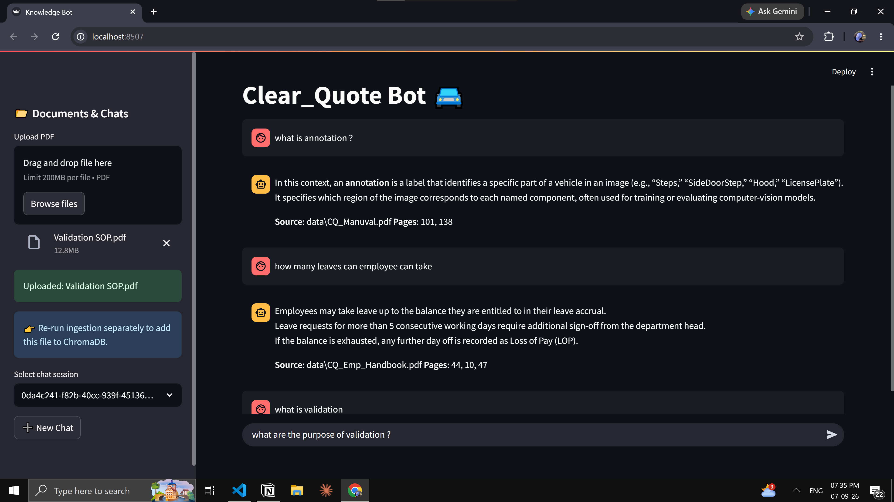

# 🚘 AI-Powered Vehicle Inspection Knowledge Assistant (RAG)

## Project Screenshot



## Overview

The **AI-Powered Vehicle Inspection Knowledge Assistant** is a Retrieval-Augmented Generation (RAG) application designed for the automotive vehicle inspection domain. It enables users to ask natural-language questions about vehicle inspection procedures, damage annotation guidelines, validation processes, and operational manuals.

The system combines **document processing, semantic embeddings, vector search, retrieval-augmented generation, conversational memory, and Large Language Models (LLMs)** to provide context-aware answers with source and page references.

The solution is implemented as an interactive **Streamlit application** and is designed to support faster and more consistent access to automotive inspection knowledge.

---

## Business Context

Automotive inspection operations depend on large volumes of inspection manuals, annotation guidelines, validation procedures, and operational documentation.

Manually searching these documents can be time-consuming and may result in inconsistent interpretation of inspection rules.

This project addresses the problem by providing an AI-powered knowledge assistant that can:

- Retrieve relevant information from inspection documentation.
- Answer domain-specific questions using retrieved context.
- Provide source and page references for traceability.
- Support conversational, multi-turn interactions.
- Reduce the time required to manually search large documentation.

The solution is particularly relevant to **vehicle inspection, damage annotation, validation, and automotive quality-control workflows**.

---

## Key Features

- **PDF Document Ingestion** – Upload and process vehicle inspection and operational documents.
- **Intelligent Text Chunking** – Splits documents into retrieval-friendly chunks with configurable chunk size and overlap.
- **Semantic Search** – Uses HuggingFace `multilingual-e5-large` embeddings to represent document content as vectors.
- **Vector Retrieval** – ChromaDB performs similarity-based retrieval of relevant document sections.
- **RAG-Based Question Answering** – Retrieved context is passed to an LLM to generate grounded responses.
- **Conversational Memory** – LangGraph maintains conversation state for multi-turn interactions.
- **Source Traceability** – Responses include the source document and relevant page numbers.
- **Interactive Streamlit UI** – Provides an easy-to-use interface for document upload and question answering.
- **Local Document Processing** – Source documents and vector data are maintained within the application environment.

---

## System Architecture

```text
                ┌─────────────────────────┐
                │   Vehicle Documents     │
                │      PDF Manuals        │
                └────────────┬────────────┘
                             │
                             ▼
                ┌─────────────────────────┐
                │   PDF Text Extraction   │
                │     & Chunking          │
                └────────────┬────────────┘
                             │
                             ▼
                ┌─────────────────────────┐
                │ HuggingFace Embeddings  │
                │ multilingual-e5-large   │
                └────────────┬────────────┘
                             │
                             ▼
                ┌─────────────────────────┐
                │       ChromaDB          │
                │    Vector Database      │
                └────────────┬────────────┘
                             │
                    Similarity Search
                             │
                             ▼
                ┌─────────────────────────┐
                │   Relevant Context      │
                │      Retrieval           │
                └────────────┬────────────┘
                             │
                             ▼
                ┌─────────────────────────┐
                │       LangGraph         │
                │ Conversation Management │
                └────────────┬────────────┘
                             │
                             ▼
                ┌─────────────────────────┐
                │   Groq LLM              │
                │   openai/gpt-oss-20b    │
                └────────────┬────────────┘
                             │
                             ▼
                ┌─────────────────────────┐
                │ Streamlit Application   │
                │ Answer + Source + Page  │
                └─────────────────────────┘
## RAG Workflow

1. Upload automotive inspection manuals and operational documents in PDF format.
2. Extract and split document content into configurable text chunks.
3. Generate semantic embeddings using `intfloat/multilingual-e5-large`.
4. Store the embeddings in **ChromaDB** for persistent vector retrieval.
5. Convert the user's natural-language question into a semantic retrieval query.
6. Retrieve the top relevant document sections using similarity search.
7. Pass the retrieved context and user question through **LangGraph** to manage the conversational workflow.
8. Generate a concise, context-grounded response using the **Groq-hosted `openai/gpt-oss-20b` LLM**.
9. Display the generated answer with source document and page-level references for traceability.

---

## Tech Stack

| Component | Technology |
|---|---|
| Programming Language | Python |
| GenAI Framework | LangChain |
| Workflow / Orchestration | LangGraph |
| User Interface | Streamlit |
| Embedding Model | `intfloat/multilingual-e5-large` |
| Vector Database | ChromaDB |
| Large Language Model | Groq – `openai/gpt-oss-20b` |
| Document Processing | PDF Parsing & Text Chunking |
| ML / Deep Learning | PyTorch, HuggingFace |
| Configuration | Python Virtual Environment, `.env` |

---

## Project Highlights

- Developed an **end-to-end Retrieval-Augmented Generation (RAG) pipeline** for automotive vehicle inspection and annotation documentation.
- Implemented **semantic document retrieval** using HuggingFace embeddings and ChromaDB.
- Integrated **LangGraph** to manage conversational state and multi-turn question answering.
- Built a **context-grounded LLM pipeline** that generates responses based on retrieved automotive documentation.
- Implemented **source and page-level traceability** to improve answer verification and explainability.
- Developed an interactive **Streamlit application** supporting PDF upload, document querying, and conversational interaction.
- Designed configurable **chunk size, chunk overlap, embedding model, LLM parameters, and persistent vector storage**.
- Applied practical **ML/GenAI debugging, dependency management, model integration, and application deployment** during end-to-end development.

---

## Business Benefits

### ⚡ Faster Knowledge Access

Enables inspection teams to retrieve relevant procedures, validation rules, and annotation guidelines within seconds instead of manually searching large documentation.

### 🎯 Improved Consistency

Provides responses grounded in approved inspection documentation, helping standardize interpretation of vehicle inspection and annotation procedures.

### 📉 Reduced Manual Effort

Automates document search and knowledge retrieval, reducing repetitive manual effort for inspection and operations teams.

### 🔍 Improved Traceability

Source document and page references allow users to verify the information supporting each generated response.

### 📈 Scalable Knowledge Architecture

The RAG architecture can be extended to additional automotive knowledge sources such as service manuals, repair procedures, compliance documents, technical specifications, and operational guidelines.

---

## Future Enhancements

- **Multimodal RAG** for inspection images, diagrams, tables, and visual documentation.
- Integration with the **YOLOv8 Vehicle Damage Detection System** to combine visual damage detection with textual inspection knowledge.
- **Hybrid retrieval** combining semantic and keyword-based search for improved domain-specific retrieval.
- **Reranking models** to improve the relevance of retrieved documents.
- Retrieval evaluation using **Precision@K, Recall@K, and MRR**.
- **Voice-enabled inspection assistant** using speech-to-text and text-to-speech.
- Automated **inspection report generation** using retrieved evidence.
- Advanced **agentic workflows with LangGraph** for multi-step inspection tasks.

---

## Conclusion

The **AI-Powered Vehicle Inspection Knowledge Assistant** demonstrates the practical application of **Machine Learning, Generative AI, and Retrieval-Augmented Generation** to an automotive domain problem.

The system combines **Python, HuggingFace embeddings, ChromaDB, LangChain, LangGraph, Groq LLMs, and Streamlit** to transform unstructured vehicle inspection documentation into an interactive knowledge-retrieval system capable of generating context-aware and source-backed responses.

This project demonstrates practical **ML Engineer capabilities across document processing, semantic embeddings, vector databases, RAG architecture, LLM integration, conversational workflows, retrieval systems, application development, and end-to-end debugging**.
